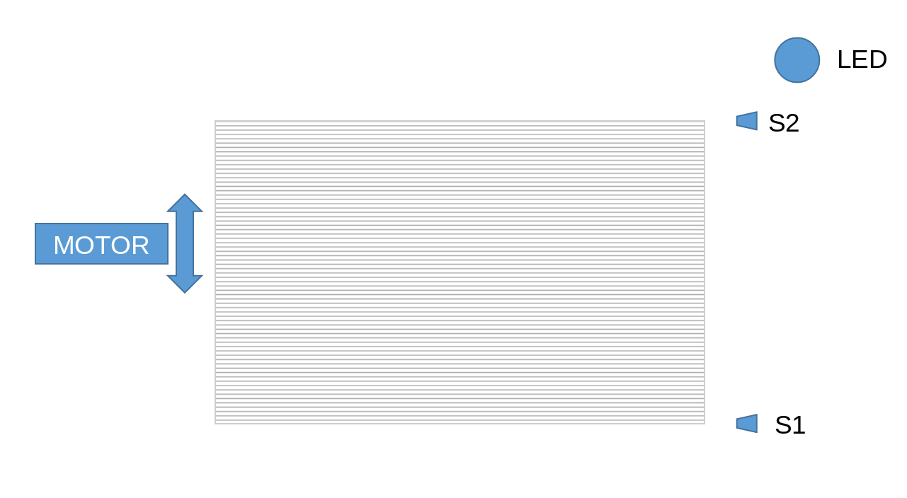
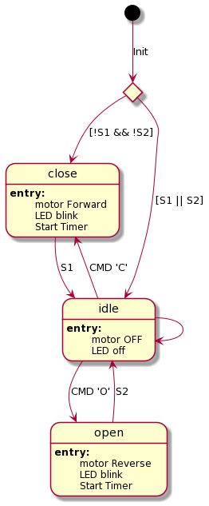
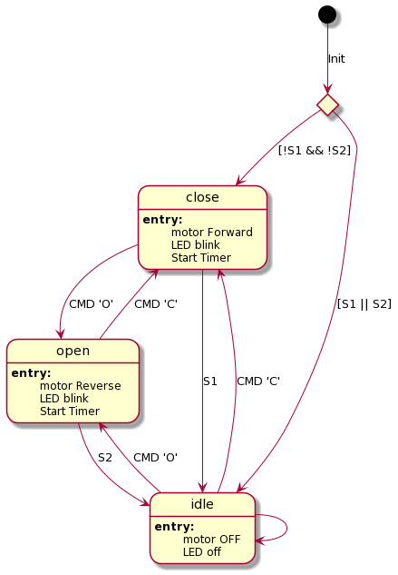
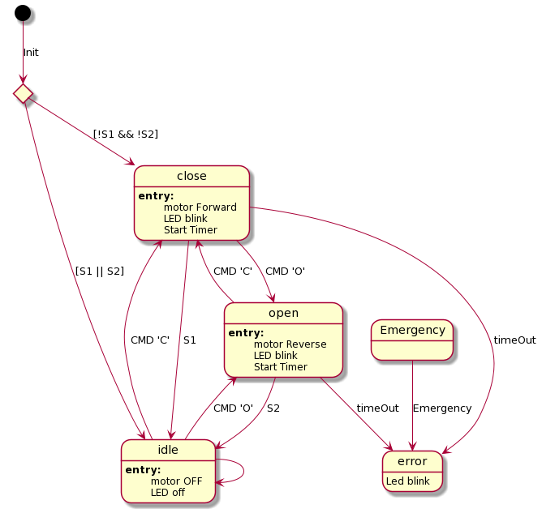

## Block diagram fungovania garážovej brány

Vstupy:
- 'o' open
- 'c' close
- '1' senzor S1
- '2' senzor s2
- 'e' Emergency stop

## Stavový automat

Tento stavový automat je implentovaný v git repozitári pomocou ETLCPP state chart frameworku.

## Úloha 1

Doplnte do automatu nové prechody medzi stavmi **Open <-> Close**.

## Úloha 2

Doplnte automat o nové stavy.

